# Use Case Specifications & Sequence Diagrams
**Project:** IELTS Online Examination & Mentor Booking System (SDN English Learning)

This document provides detailed Use Case specifications, including Use Case segment diagrams (with system boundaries), and Sequence Diagrams illustrating the interactions between Actors, Frontend (UI), Backend Server, and MongoDB Database. All descriptions, preconditions, postconditions, normal flows, alternative flows, exceptions, and business rules conform to formal technical specification standards.

---

## 1. Global Use Case Diagram

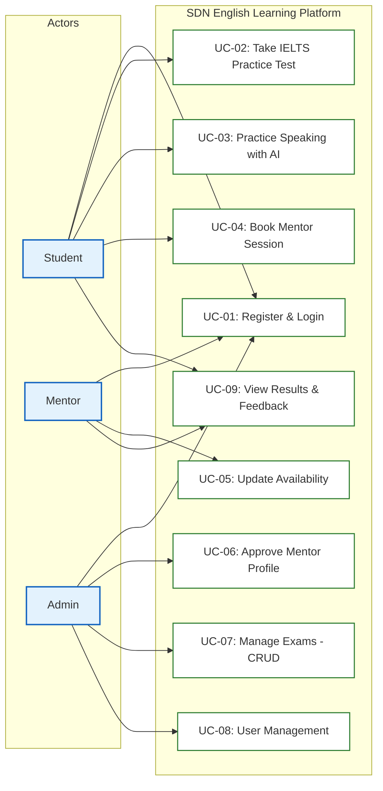

---

## 2. Actors Definition

| Actor | Role Description |
| :--- | :--- |
| **Student** | Learners who use the system to take IELTS mock tests, practice speaking with AI, book sessions with Mentors, and view performance results. |
| **Mentor** | Instructors who list their tutoring availabilities, host 1-on-1 tutoring sessions, and provide feedback/session notes. |
| **Admin** | Administrators who manage tests (CRUD exams), approve mentor registrations, control user statuses, and view metrics. |

---

## 3. Detailed Use Case Specifications, Segment Diagrams, and Sequence Diagrams

### UC-01: Register & Login

* **Use Case Segment Diagram:**
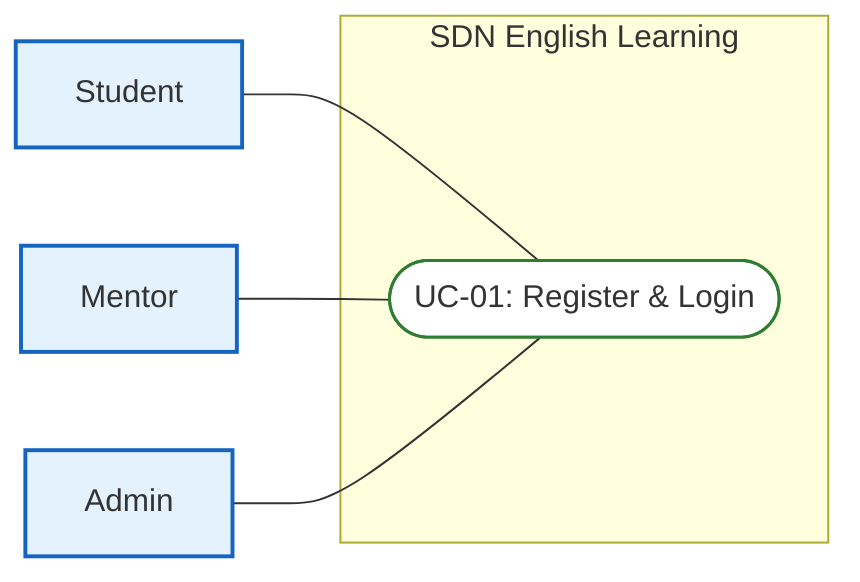

* **Functional Description Template:**
<table style="width: 100%; border-collapse: collapse; margin-bottom: 24px; border: 2px solid #0f172a; font-family: sans-serif; font-size: 14px;">
  <tr>
    <td style="width: 20%; font-weight: bold; background-color: #f1f5f9; padding: 10px; border: 1px solid #cbd5e1;">UC ID and Name:</td>
    <td colspan="3" style="padding: 10px; border: 1px solid #cbd5e1; font-weight: bold; color: #005c42;">UC-01: Register & Login</td>
  </tr>
  <tr>
    <td style="font-weight: bold; background-color: #f1f5f9; padding: 10px; border: 1px solid #cbd5e1;">Created By:</td>
    <td style="width: 30%; padding: 10px; border: 1px solid #cbd5e1;">SDN Dev Team</td>
    <td style="width: 20%; font-weight: bold; background-color: #f1f5f9; padding: 10px; border: 1px solid #cbd5e1;">Date Created:</td>
    <td style="width: 30%; padding: 10px; border: 1px solid #cbd5e1;">2026-06-16</td>
  </tr>
  <tr>
    <td style="font-weight: bold; background-color: #f1f5f9; padding: 10px; border: 1px solid #cbd5e1;">Primary Actor:</td>
    <td style="padding: 10px; border: 1px solid #cbd5e1;">Student, Mentor, Admin</td>
    <td style="font-weight: bold; background-color: #f1f5f9; padding: 10px; border: 1px solid #cbd5e1;">Secondary Actors:</td>
    <td style="padding: 10px; border: 1px solid #cbd5e1;">None</td>
  </tr>
  <tr>
    <td style="font-weight: bold; background-color: #f1f5f9; padding: 10px; border: 1px solid #cbd5e1;">Trigger:</td>
    <td colspan="3" style="padding: 10px; border: 1px solid #cbd5e1;">User wants to sign up for a new account or log into an existing account.</td>
  </tr>
  <tr>
    <td style="font-weight: bold; background-color: #f1f5f9; padding: 10px; border: 1px solid #cbd5e1;">Description:</td>
    <td colspan="3" style="padding: 10px; border: 1px solid #cbd5e1;">Allows users to register a new account (Student/Mentor) or log in to establish an active session on the platform.</td>
  </tr>
  <tr>
    <td style="font-weight: bold; background-color: #f1f5f9; padding: 10px; border: 1px solid #cbd5e1;">Preconditions:</td>
    <td colspan="3" style="padding: 10px; border: 1px solid #cbd5e1; line-height: 1.5;">
      PRE-1: User has internet connectivity. 
      PRE-2: Login requires an existing, active account registered in the database.
    </td>
  </tr>
  <tr>
    <td style="font-weight: bold; background-color: #f1f5f9; padding: 10px; border: 1px solid #cbd5e1;">Postconditions:</td>
    <td colspan="3" style="padding: 10px; border: 1px solid #cbd5e1; line-height: 1.5;">
      POST-1: System issues Access Token (Redux state) and Refresh Token (HTTP-Only Cookie). 
      POST-2: User is redirected to their role-specific Dashboard.
    </td>
  </tr>
  <tr>
    <td style="font-weight: bold; background-color: #f1f5f9; padding: 10px; border: 1px solid #cbd5e1;">Normal Flow:</td>
    <td colspan="3" style="padding: 10px; border: 1px solid #cbd5e1; line-height: 1.5;">
      <strong>1.0: Authentication & Access Normal Flow</strong> 
      1.0.1. User (Actor): Clicks Register or Login button on the homepage. 
      1.0.2. System (System): Displays the Register/Login forms with corresponding fields. 
      1.0.3. User (Actor): Fills in required credentials (username, password, details) and clicks submit. 
      1.0.4. System (System): Validates formats, validates credentials in DB, and hashes new passwords if registering. 
      1.0.5. System (System): Establishes session tokens, saves login activity, and redirects user to Dashboard.
    </td>
  </tr>
  <tr>
    <td style="font-weight: bold; background-color: #f1f5f9; padding: 10px; border: 1px solid #cbd5e1;">Alternative Flows:</td>
    <td colspan="3" style="padding: 10px; border: 1px solid #cbd5e1; line-height: 1.5;">
      <strong>1.1: Logout Flow</strong> 
      - Branches from step 1.0.5. User clicks logout on dashboard. 
      - System invalidates the JWT tokens in DB, deletes HTTP-Only cookies, and redirects user back to homepage.
    </td>
  </tr>
  <tr>
    <td style="font-weight: bold; background-color: #f1f5f9; padding: 10px; border: 1px solid #cbd5e1;">Exceptions:</td>
    <td colspan="3" style="padding: 10px; border: 1px solid #cbd5e1; line-height: 1.5;">
      <strong>1.0.E1: Duplicate Registration Info</strong> (occurs at 1.0.4; registration fails, system displays duplicate field message, database state remains unchanged). 
      <strong>1.0.E2: Invalid Credentials</strong> (occurs at 1.0.4; login fails, system displays invalid credentials toast; no session established). 
      <strong>1.0.E3: Account Pending Approval</strong> (occurs at 1.0.4; login fails, system displays "account pending verification" warning; no session established).
    </td>
  </tr>
  <tr>
    <td style="font-weight: bold; background-color: #f1f5f9; padding: 10px; border: 1px solid #cbd5e1;">Priority:</td>
    <td colspan="3" style="padding: 10px; border: 1px solid #cbd5e1;">High (Must Have)</td>
  </tr>
  <tr>
    <td style="font-weight: bold; background-color: #f1f5f9; padding: 10px; border: 1px solid #cbd5e1;">Frequency of Use:</td>
    <td colspan="3" style="padding: 10px; border: 1px solid #cbd5e1;">Very High (Every user session)</td>
  </tr>
  <tr>
    <td style="font-weight: bold; background-color: #f1f5f9; padding: 10px; border: 1px solid #cbd5e1;">Business Rules:</td>
    <td colspan="3" style="padding: 10px; border: 1px solid #cbd5e1;">BR-01</td>
  </tr>
  <tr>
    <td style="font-weight: bold; background-color: #f1f5f9; padding: 10px; border: 1px solid #cbd5e1;">Other Information:</td>
    <td colspan="3" style="padding: 10px; border: 1px solid #cbd5e1;">Access Token expires in 15 minutes, Refresh Token expires in 7 days. In case of network failure during submission, state remains unchanged.</td>
  </tr>
  <tr>
    <td style="font-weight: bold; background-color: #f1f5f9; padding: 10px; border: 1px solid #cbd5e1;">Assumptions:</td>
    <td colspan="3" style="padding: 10px; border: 1px solid #cbd5e1;">User browser supports secure HTTPS protocol and cookie tracking.</td>
  </tr>
</table>

#### Sequence Diagram
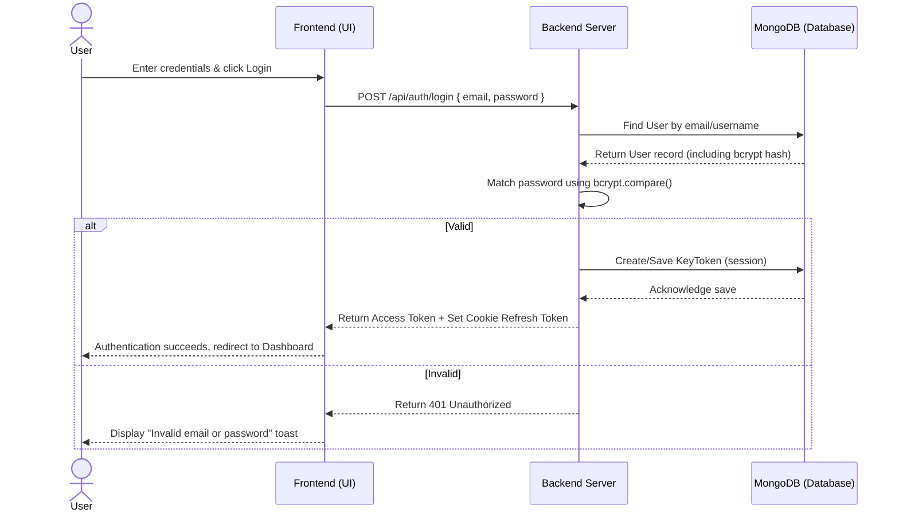

---

### UC-02: Take IELTS Practice Test (Reading/Listening)

* **Use Case Segment Diagram:**
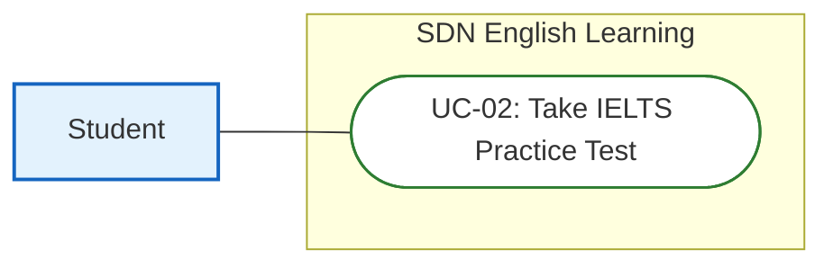

* **Functional Description Template:**
<table style="width: 100%; border-collapse: collapse; margin-bottom: 24px; border: 2px solid #0f172a; font-family: sans-serif; font-size: 14px;">
  <tr>
    <td style="width: 20%; font-weight: bold; background-color: #f1f5f9; padding: 10px; border: 1px solid #cbd5e1;">UC ID and Name:</td>
    <td colspan="3" style="padding: 10px; border: 1px solid #cbd5e1; font-weight: bold; color: #005c42;">UC-02: Take IELTS Practice Test</td>
  </tr>
  <tr>
    <td style="font-weight: bold; background-color: #f1f5f9; padding: 10px; border: 1px solid #cbd5e1;">Created By:</td>
    <td style="width: 30%; padding: 10px; border: 1px solid #cbd5e1;">SDN Dev Team</td>
    <td style="width: 20%; font-weight: bold; background-color: #f1f5f9; padding: 10px; border: 1px solid #cbd5e1;">Date Created:</td>
    <td style="width: 30%; padding: 10px; border: 1px solid #cbd5e1;">2026-06-16</td>
  </tr>
  <tr>
    <td style="font-weight: bold; background-color: #f1f5f9; padding: 10px; border: 1px solid #cbd5e1;">Primary Actor:</td>
    <td style="padding: 10px; border: 1px solid #cbd5e1;">Student</td>
    <td style="font-weight: bold; background-color: #f1f5f9; padding: 10px; border: 1px solid #cbd5e1;">Secondary Actors:</td>
    <td style="padding: 10px; border: 1px solid #cbd5e1;">None</td>
  </tr>
  <tr>
    <td style="font-weight: bold; background-color: #f1f5f9; padding: 10px; border: 1px solid #cbd5e1;">Trigger:</td>
    <td colspan="3" style="padding: 10px; border: 1px solid #cbd5e1;">Student selects an exam from the test library and clicks start.</td>
  </tr>
  <tr>
    <td style="font-weight: bold; background-color: #f1f5f9; padding: 10px; border: 1px solid #cbd5e1;">Description:</td>
    <td colspan="3" style="padding: 10px; border: 1px solid #cbd5e1;">Student takes an IELTS Reading or Listening mock exam under real test conditions with a countdown timer, split-screen UI, and auto-submission on timeout.</td>
  </tr>
  <tr>
    <td style="font-weight: bold; background-color: #f1f5f9; padding: 10px; border: 1px solid #cbd5e1;">Preconditions:</td>
    <td colspan="3" style="padding: 10px; border: 1px solid #cbd5e1; line-height: 1.5;">
      PRE-1: Student is logged in. 
      PRE-2: Selected mock test is published in the database.
    </td>
  </tr>
  <tr>
    <td style="font-weight: bold; background-color: #f1f5f9; padding: 10px; border: 1px solid #cbd5e1;">Postconditions:</td>
    <td colspan="3" style="padding: 10px; border: 1px solid #cbd5e1; line-height: 1.5;">
      POST-1: Student's answers and band scores are saved as a TestResult document (correct counts, Band score, duration). 
      POST-2: Exam status is marked as completed in user profile.
    </td>
  </tr>
  <tr>
    <td style="font-weight: bold; background-color: #f1f5f9; padding: 10px; border: 1px solid #cbd5e1;">Normal Flow:</td>
    <td colspan="3" style="padding: 10px; border: 1px solid #cbd5e1; line-height: 1.5;">
      <strong>2.0: Examination Taking Flow</strong> 
      2.0.1. Student (Actor): Selects a mock test from the test library and clicks Start. 
      2.0.2. System (System): Fetches questions, hides answer key, starts timer, and renders split-screen UI. 
      2.0.3. Student (Actor): Inputs answers into the question sheet fields. 
      2.0.4. System (System): Saves temporary state to LocalStorage after every field modification. 
      2.0.5. Student (Actor): Clicks the submit button. 
      2.0.6. System (System): Grades submissions against correct Answer Key, calculates IELTS Band Score, saves TestResult in DB, and returns scoreboards.
    </td>
  </tr>
  <tr>
    <td style="font-weight: bold; background-color: #f1f5f9; padding: 10px; border: 1px solid #cbd5e1;">Alternative Flows:</td>
    <td colspan="3" style="padding: 10px; border: 1px solid #cbd5e1; line-height: 1.5;">
      <strong>2.1: Auto-submit on Timer Expiration</strong> 
      - Branches off from step 2.0.3. Timer reaches zero. 
      - System disables inputs, blocks further editing, and automatically submits answers to Backend (rejoining flow at 2.0.6).
    </td>
  </tr>
  <tr>
    <td style="font-weight: bold; background-color: #f1f5f9; padding: 10px; border: 1px solid #cbd5e1;">Exceptions:</td>
    <td colspan="3" style="padding: 10px; border: 1px solid #cbd5e1; line-height: 1.5;">
      <strong>2.0.E1: Connection Lost during Submission</strong> (occurs at 2.0.5; system caches submission in LocalStorage, retries automatically; state completed when connection is restored). 
      <strong>2.0.E2: Page Refresh (F5)</strong> (occurs at 2.0.3; frontend restores answers from LocalStorage and continues countdown; no DB state lost).
    </td>
  </tr>
  <tr>
    <td style="font-weight: bold; background-color: #f1f5f9; padding: 10px; border: 1px solid #cbd5e1;">Priority:</td>
    <td colspan="3" style="padding: 10px; border: 1px solid #cbd5e1;">High (Must Have)</td>
  </tr>
  <tr>
    <td style="font-weight: bold; background-color: #f1f5f9; padding: 10px; border: 1px solid #cbd5e1;">Frequency of Use:</td>
    <td colspan="3" style="padding: 10px; border: 1px solid #cbd5e1;">High (Multiple times daily per student)</td>
  </tr>
  <tr>
    <td style="font-weight: bold; background-color: #f1f5f9; padding: 10px; border: 1px solid #cbd5e1;">Business Rules:</td>
    <td colspan="3" style="padding: 10px; border: 1px solid #cbd5e1;">BR-02</td>
  </tr>
  <tr>
    <td style="font-weight: bold; background-color: #f1f5f9; padding: 10px; border: 1px solid #cbd5e1;">Other Information:</td>
    <td colspan="3" style="padding: 10px; border: 1px solid #cbd5e1;">Explanations and correct options are hidden until submission is registered. In case of systemic crash, student answers are cached in LocalStorage.</td>
  </tr>
  <tr>
    <td style="font-weight: bold; background-color: #f1f5f9; padding: 10px; border: 1px solid #cbd5e1;">Assumptions:</td>
    <td colspan="3" style="padding: 10px; border: 1px solid #cbd5e1;">Student's device does not auto-delete LocalStorage files during testing.</td>
  </tr>
</table>

#### Sequence Diagram
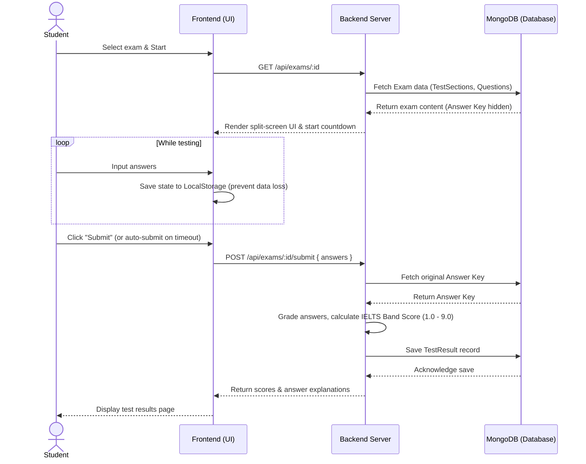

---

### UC-03: Practice Speaking with AI

* **Use Case Segment Diagram:**
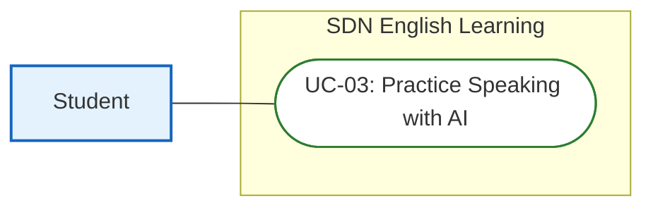

* **Functional Description Template:**
<table style="width: 100%; border-collapse: collapse; margin-bottom: 24px; border: 2px solid #0f172a; font-family: sans-serif; font-size: 14px;">
  <tr>
    <td style="width: 20%; font-weight: bold; background-color: #f1f5f9; padding: 10px; border: 1px solid #cbd5e1;">UC ID and Name:</td>
    <td colspan="3" style="padding: 10px; border: 1px solid #cbd5e1; font-weight: bold; color: #005c42;">UC-03: Practice Speaking with AI</td>
  </tr>
  <tr>
    <td style="font-weight: bold; background-color: #f1f5f9; padding: 10px; border: 1px solid #cbd5e1;">Created By:</td>
    <td style="width: 30%; padding: 10px; border: 1px solid #cbd5e1;">SDN Dev Team</td>
    <td style="width: 20%; font-weight: bold; background-color: #f1f5f9; padding: 10px; border: 1px solid #cbd5e1;">Date Created:</td>
    <td style="width: 30%; padding: 10px; border: 1px solid #cbd5e1;">2026-06-16</td>
  </tr>
  <tr>
    <td style="font-weight: bold; background-color: #f1f5f9; padding: 10px; border: 1px solid #cbd5e1;">Primary Actor:</td>
    <td style="padding: 10px; border: 1px solid #cbd5e1;">Student</td>
    <td style="font-weight: bold; background-color: #f1f5f9; padding: 10px; border: 1px solid #cbd5e1;">Secondary Actors:</td>
    <td style="padding: 10px; border: 1px solid #cbd5e1;">None</td>
  </tr>
  <tr>
    <td style="font-weight: bold; background-color: #f1f5f9; padding: 10px; border: 1px solid #cbd5e1;">Trigger:</td>
    <td colspan="3" style="padding: 10px; border: 1px solid #cbd5e1;">Student selects a Speaking topic card and clicks start recording.</td>
  </tr>
  <tr>
    <td style="font-weight: bold; background-color: #f1f5f9; padding: 10px; border: 1px solid #cbd5e1;">Description:</td>
    <td colspan="3" style="padding: 10px; border: 1px solid #cbd5e1;">Student records response for a selected Speaking Cue Card. Audio is processed, transcribed, and evaluated by Gemini API across 4 official IELTS criteria.</td>
  </tr>
  <tr>
    <td style="font-weight: bold; background-color: #f1f5f9; padding: 10px; border: 1px solid #cbd5e1;">Preconditions:</td>
    <td colspan="3" style="padding: 10px; border: 1px solid #cbd5e1; line-height: 1.5;">
      PRE-1: Student is logged in. 
      PRE-2: Browser microphone access permission is granted.
    </td>
  </tr>
  <tr>
    <td style="font-weight: bold; background-color: #f1f5f9; padding: 10px; border: 1px solid #cbd5e1;">Postconditions:</td>
    <td colspan="3" style="padding: 10px; border: 1px solid #cbd5e1; line-height: 1.5;">
      POST-1: Graded speaking parameters and transcribed text are saved in a SpeakingSubmission record. 
      POST-2: Audio temporary files are deleted from the server.
    </td>
  </tr>
  <tr>
    <td style="font-weight: bold; background-color: #f1f5f9; padding: 10px; border: 1px solid #cbd5e1;">Normal Flow:</td>
    <td colspan="3" style="padding: 10px; border: 1px solid #cbd5e1; line-height: 1.5;">
      <strong>3.0: AI Speaking Evaluation Flow</strong> 
      3.0.1. Student (Actor): Selects a Speaking Cue Card and clicks Start Recording. 
      3.0.2. System (System): Opens audio capture stream. 
      3.0.3. Student (Actor): Speaks their response into the microphone. 
      3.0.4. System (System): Streams audio buffers to Backend in real-time via Socket.io. 
      3.0.5. Student (Actor): Clicks Stop Recording. 
      3.0.6. System (System): Sends audio to Speech-to-Text service, requests Gemini API scoring, saves details to DB, and displays scores.
    </td>
  </tr>
  <tr>
    <td style="font-weight: bold; background-color: #f1f5f9; padding: 10px; border: 1px solid #cbd5e1;">Alternative Flows:</td>
    <td colspan="3" style="padding: 10px; border: 1px solid #cbd5e1; line-height: 1.5;">
      <strong>3.1: Duration Limit Exceeded</strong> 
      - Branches off from step 3.0.3. Recording duration reaches the 2-minute maximum limit. 
      - System automatically terminates recording and sends stop signal to Backend (rejoining flow at 3.0.6).
    </td>
  </tr>
  <tr>
    <td style="font-weight: bold; background-color: #f1f5f9; padding: 10px; border: 1px solid #cbd5e1;">Exceptions:</td>
    <td colspan="3" style="padding: 10px; border: 1px solid #cbd5e1; line-height: 1.5;">
      <strong>3.0.E1: Microphone Permission Denied</strong> (occurs at 3.0.2; System displays warning toast requesting mic permissions, stops flow; no database state change). 
      <strong>3.0.E2: AI API Timeout</strong> (occurs at 3.0.6; request fails; system retries up to 3 times; if failure persists, student is notified and audio cache deleted; database state remains unchanged).
    </td>
  </tr>
  <tr>
    <td style="font-weight: bold; background-color: #f1f5f9; padding: 10px; border: 1px solid #cbd5e1;">Priority:</td>
    <td colspan="3" style="padding: 10px; border: 1px solid #cbd5e1;">High (Must Have)</td>
  </tr>
  <tr>
    <td style="font-weight: bold; background-color: #f1f5f9; padding: 10px; border: 1px solid #cbd5e1;">Frequency of Use:</td>
    <td colspan="3" style="padding: 10px; border: 1px solid #cbd5e1;">High (Student practice loops)</td>
  </tr>
  <tr>
    <td style="font-weight: bold; background-color: #f1f5f9; padding: 10px; border: 1px solid #cbd5e1;">Business Rules:</td>
    <td colspan="3" style="padding: 10px; border: 1px solid #cbd5e1;">BR-03</td>
  </tr>
  <tr>
    <td style="font-weight: bold; background-color: #f1f5f9; padding: 10px; border: 1px solid #cbd5e1;">Other Information:</td>
    <td colspan="3" style="padding: 10px; border: 1px solid #cbd5e1;">Performance SLA: AI feedback returned in under 7 seconds. Audio cache cleared immediately upon final grading.</td>
  </tr>
  <tr>
    <td style="font-weight: bold; background-color: #f1f5f9; padding: 10px; border: 1px solid #cbd5e1;">Assumptions:</td>
    <td colspan="3" style="padding: 10px; border: 1px solid #cbd5e1;">Voice inputs are recorded in a relatively low-noise environment for correct speech transcription.</td>
  </tr>
</table>

#### Sequence Diagram
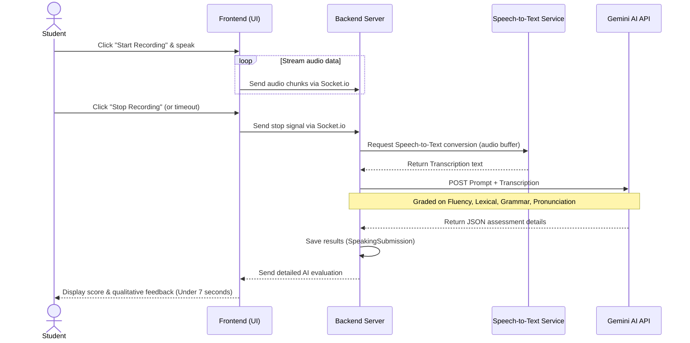

---

### UC-04: Book Mentor Session

* **Use Case Segment Diagram:**
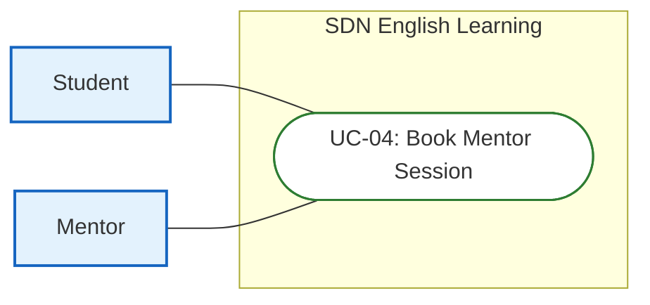

* **Functional Description Template:**
<table style="width: 100%; border-collapse: collapse; margin-bottom: 24px; border: 2px solid #0f172a; font-family: sans-serif; font-size: 14px;">
  <tr>
    <td style="width: 20%; font-weight: bold; background-color: #f1f5f9; padding: 10px; border: 1px solid #cbd5e1;">UC ID and Name:</td>
    <td colspan="3" style="padding: 10px; border: 1px solid #cbd5e1; font-weight: bold; color: #005c42;">UC-04: Book Mentor Session</td>
  </tr>
  <tr>
    <td style="font-weight: bold; background-color: #f1f5f9; padding: 10px; border: 1px solid #cbd5e1;">Created By:</td>
    <td style="width: 30%; padding: 10px; border: 1px solid #cbd5e1;">SDN Dev Team</td>
    <td style="width: 20%; font-weight: bold; background-color: #f1f5f9; padding: 10px; border: 1px solid #cbd5e1;">Date Created:</td>
    <td style="width: 30%; padding: 10px; border: 1px solid #cbd5e1;">2026-06-16</td>
  </tr>
  <tr>
    <td style="font-weight: bold; background-color: #f1f5f9; padding: 10px; border: 1px solid #cbd5e1;">Primary Actor:</td>
    <td style="padding: 10px; border: 1px solid #cbd5e1;">Student</td>
    <td style="font-weight: bold; background-color: #f1f5f9; padding: 10px; border: 1px solid #cbd5e1;">Secondary Actors:</td>
    <td style="padding: 10px; border: 1px solid #cbd5e1;">Mentor</td>
  </tr>
  <tr>
    <td style="font-weight: bold; background-color: #f1f5f9; padding: 10px; border: 1px solid #cbd5e1;">Trigger:</td>
    <td colspan="3" style="padding: 10px; border: 1px solid #cbd5e1;">Student selects a vacant hour slot on Mentor calendar and clicks Book Session.</td>
  </tr>
  <tr>
    <td style="font-weight: bold; background-color: #f1f5f9; padding: 10px; border: 1px solid #cbd5e1;">Description:</td>
    <td colspan="3" style="padding: 10px; border: 1px solid #cbd5e1;">Student books a 1-on-1 tutoring session. Concurrency is handled via Redis lock to prevent double-booking conflicts.</td>
  </tr>
  <tr>
    <td style="font-weight: bold; background-color: #f1f5f9; padding: 10px; border: 1px solid #cbd5e1;">Preconditions:</td>
    <td colspan="3" style="padding: 10px; border: 1px solid #cbd5e1; line-height: 1.5;">
      PRE-1: Student is logged in. 
      PRE-2: Selected availability slot is vacant (isBooked == false) and in the future.
    </td>
  </tr>
  <tr>
    <td style="font-weight: bold; background-color: #f1f5f9; padding: 10px; border: 1px solid #cbd5e1;">Postconditions:</td>
    <td colspan="3" style="padding: 10px; border: 1px solid #cbd5e1; line-height: 1.5;">
      POST-1: A new Booking entry is created in the database. 
      POST-2: Availability status is updated to booked (isBooked = true).
    </td>
  </tr>
  <tr>
    <td style="font-weight: bold; background-color: #f1f5f9; padding: 10px; border: 1px solid #cbd5e1;">Normal Flow:</td>
    <td colspan="3" style="padding: 10px; border: 1px solid #cbd5e1; line-height: 1.5;">
      <strong>4.0: Mentor Session Booking Flow</strong> 
      4.0.1. Student (Actor): Opens Mentor availability list and selects a slot, then clicks Book Session. 
      4.0.2. System (System): Displays booking details confirmation dialog. 
      4.0.3. Student (Actor): Confirms booking slot details. 
      4.0.4. System (System): Sets a Redis lock on availabilityId, verifies vacancy, inserts Booking record in DB, marks availability slot as isBooked = true, and releases Redis lock. 
      4.0.5. System (System): Renders success page showing Google Meet link and sends confirmation alerts.
    </td>
  </tr>
  <tr>
    <td style="font-weight: bold; background-color: #f1f5f9; padding: 10px; border: 1px solid #cbd5e1;">Alternative Flows:</td>
    <td colspan="3" style="padding: 10px; border: 1px solid #cbd5e1;">None</td>
  </tr>
  <tr>
    <td style="font-weight: bold; background-color: #f1f5f9; padding: 10px; border: 1px solid #cbd5e1;">Exceptions:</td>
    <td colspan="3" style="padding: 10px; border: 1px solid #cbd5e1; line-height: 1.5;">
      <strong>4.0.E1: Concurrency Race Condition</strong> (occurs at 4.0.4; Redis lock acquisition fails because slot is already being booked; system returns 409 Conflict, cancels booking creation, and rolls back database transaction; student is prompted with error).
    </td>
  </tr>
  <tr>
    <td style="font-weight: bold; background-color: #f1f5f9; padding: 10px; border: 1px solid #cbd5e1;">Priority:</td>
    <td colspan="3" style="padding: 10px; border: 1px solid #cbd5e1;">High (Must Have)</td>
  </tr>
  <tr>
    <td style="font-weight: bold; background-color: #f1f5f9; padding: 10px; border: 1px solid #cbd5e1;">Frequency of Use:</td>
    <td colspan="3" style="padding: 10px; border: 1px solid #cbd5e1;">High (Daily platform bookings)</td>
  </tr>
  <tr>
    <td style="font-weight: bold; background-color: #f1f5f9; padding: 10px; border: 1px solid #cbd5e1;">Business Rules:</td>
    <td colspan="3" style="padding: 10px; border: 1px solid #cbd5e1;">BR-04</td>
  </tr>
  <tr>
    <td style="font-weight: bold; background-color: #f1f5f9; padding: 10px; border: 1px solid #cbd5e1;">Other Information:</td>
    <td colspan="3" style="padding: 10px; border: 1px solid #cbd5e1;">Redis Lock has a 10-second TTL to avoid locking hung requests. State rollback guaranteed.</td>
  </tr>
  <tr>
    <td style="font-weight: bold; background-color: #f1f5f9; padding: 10px; border: 1px solid #cbd5e1;">Assumptions:</td>
    <td colspan="3" style="padding: 10px; border: 1px solid #cbd5e1;">Redis cache server operates with low latency response times.</td>
  </tr>
</table>

#### Sequence Diagram
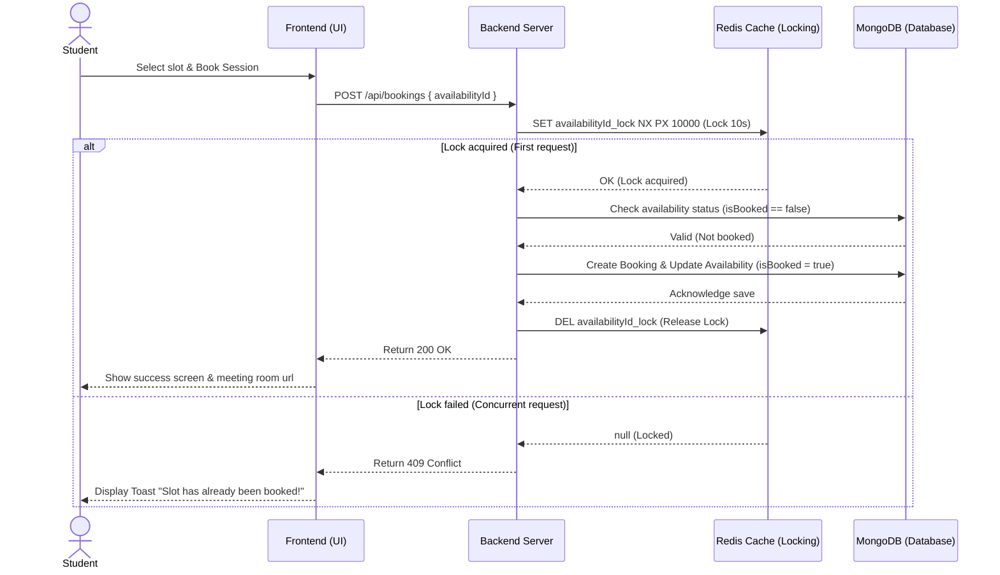

---

### UC-05: Update Availability

* **Use Case Segment Diagram:**
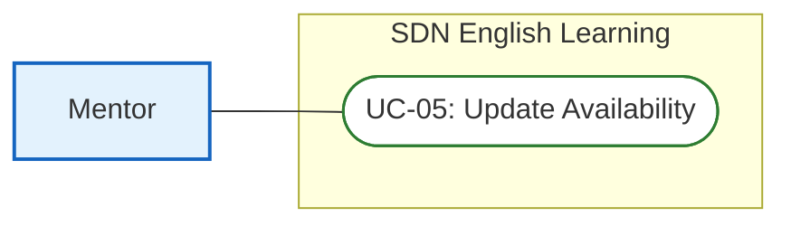

* **Functional Description Template:**
<table style="width: 100%; border-collapse: collapse; margin-bottom: 24px; border: 2px solid #0f172a; font-family: sans-serif; font-size: 14px;">
  <tr>
    <td style="width: 20%; font-weight: bold; background-color: #f1f5f9; padding: 10px; border: 1px solid #cbd5e1;">UC ID and Name:</td>
    <td colspan="3" style="padding: 10px; border: 1px solid #cbd5e1; font-weight: bold; color: #005c42;">UC-05: Update Availability</td>
  </tr>
  <tr>
    <td style="font-weight: bold; background-color: #f1f5f9; padding: 10px; border: 1px solid #cbd5e1;">Created By:</td>
    <td style="width: 30%; padding: 10px; border: 1px solid #cbd5e1;">SDN Dev Team</td>
    <td style="width: 20%; font-weight: bold; background-color: #f1f5f9; padding: 10px; border: 1px solid #cbd5e1;">Date Created:</td>
    <td style="width: 30%; padding: 10px; border: 1px solid #cbd5e1;">2026-06-16</td>
  </tr>
  <tr>
    <td style="font-weight: bold; background-color: #f1f5f9; padding: 10px; border: 1px solid #cbd5e1;">Primary Actor:</td>
    <td style="padding: 10px; border: 1px solid #cbd5e1;">Mentor</td>
    <td style="font-weight: bold; background-color: #f1f5f9; padding: 10px; border: 1px solid #cbd5e1;">Secondary Actors:</td>
    <td style="padding: 10px; border: 1px solid #cbd5e1;">None</td>
  </tr>
  <tr>
    <td style="font-weight: bold; background-color: #f1f5f9; padding: 10px; border: 1px solid #cbd5e1;">Trigger:</td>
    <td colspan="3" style="padding: 10px; border: 1px solid #cbd5e1;">Mentor opens schedule manager and sets availability time frames.</td>
  </tr>
  <tr>
    <td style="font-weight: bold; background-color: #f1f5f9; padding: 10px; border: 1px solid #cbd5e1;">Description:</td>
    <td colspan="3" style="padding: 10px; border: 1px solid #cbd5e1;">Mentor adds slot timings and provides video conference room links (Zoom/Google Meet) for students to select.</td>
  </tr>
  <tr>
    <td style="font-weight: bold; background-color: #f1f5f9; padding: 10px; border: 1px solid #cbd5e1;">Preconditions:</td>
    <td colspan="3" style="padding: 10px; border: 1px solid #cbd5e1; line-height: 1.5;">
      PRE-1: Mentor is logged in. 
      PRE-2: Mentor verification status is marked active.
    </td>
  </tr>
  <tr>
    <td style="font-weight: bold; background-color: #f1f5f9; padding: 10px; border: 1px solid #cbd5e1;">Postconditions:</td>
    <td colspan="3" style="padding: 10px; border: 1px solid #cbd5e1; line-height: 1.5;">
      POST-1: New Availability records are created in DB and listed on profile search.
    </td>
  </tr>
  <tr>
    <td style="font-weight: bold; background-color: #f1f5f9; padding: 10px; border: 1px solid #cbd5e1;">Normal Flow:</td>
    <td colspan="3" style="padding: 10px; border: 1px solid #cbd5e1; line-height: 1.5;">
      <strong>5.0: Availability Slot Adding Flow</strong> 
      5.0.1. Mentor (Actor): Navigates to the Availability section on dashboard. 
      5.0.2. System (System): Displays the calendar grid schedule builder interface. 
      5.0.3. Mentor (Actor): Enters slot date, start time, end time, meet link, and clicks Add Slot. 
      5.0.4. System (System): Validates fields, checks for duplicate overlaps in DB, and saves new slots with isBooked = false. 
      5.0.5. System (System): Displays new slot on the calendar grid dashboard.
    </td>
  </tr>
  <tr>
    <td style="font-weight: bold; background-color: #f1f5f9; padding: 10px; border: 1px solid #cbd5e1;">Alternative Flows:</td>
    <td colspan="3" style="padding: 10px; border: 1px solid #cbd5e1; line-height: 1.5;">
      <strong>5.1: Slot Removal Flow</strong> 
      - Branches off from step 5.0.1. Mentor selects an unbooked slot and clicks Delete. 
      - System deletes availability record from database and updates grid (rejoining flow at 5.0.5).
    </td>
  </tr>
  <tr>
    <td style="font-weight: bold; background-color: #f1f5f9; padding: 10px; border: 1px solid #cbd5e1;">Exceptions:</td>
    <td colspan="3" style="padding: 10px; border: 1px solid #cbd5e1; line-height: 1.5;">
      <strong>5.0.E1: Time Overlap Detected</strong> (occurs at 5.0.4; System blocks creation, prompts overlap warning toast; database state unchanged). 
      <strong>5.0.E2: Modify Booked Slot</strong> (occurs at 5.1; slot is booked [isBooked == true]; system disables delete button and blocks action; database state remains locked).
    </td>
  </tr>
  <tr>
    <td style="font-weight: bold; background-color: #f1f5f9; padding: 10px; border: 1px solid #cbd5e1;">Priority:</td>
    <td colspan="3" style="padding: 10px; border: 1px solid #cbd5e1;">Medium (Should Have)</td>
  </tr>
  <tr>
    <td style="font-weight: bold; background-color: #f1f5f9; padding: 10px; border: 1px solid #cbd5e1;">Frequency of Use:</td>
    <td colspan="3" style="padding: 10px; border: 1px solid #cbd5e1;">Weekly (Mentor availability scheduling)</td>
  </tr>
  <tr>
    <td style="font-weight: bold; background-color: #f1f5f9; padding: 10px; border: 1px solid #cbd5e1;">Business Rules:</td>
    <td colspan="3" style="padding: 10px; border: 1px solid #cbd5e1;">BR-04</td>
  </tr>
  <tr>
    <td style="font-weight: bold; background-color: #f1f5f9; padding: 10px; border: 1px solid #cbd5e1;">Other Information:</td>
    <td colspan="3" style="padding: 10px; border: 1px solid #cbd5e1;">Meeting URLs must match valid patterns. Overlaps are blocked completely.</td>
  </tr>
  <tr>
    <td style="font-weight: bold; background-color: #f1f5f9; padding: 10px; border: 1px solid #cbd5e1;">Assumptions:</td>
    <td colspan="3" style="padding: 10px; border: 1px solid #cbd5e1;">Mentor dashboard client timezone aligns with backend server timezone definitions.</td>
  </tr>
</table>

#### Sequence Diagram
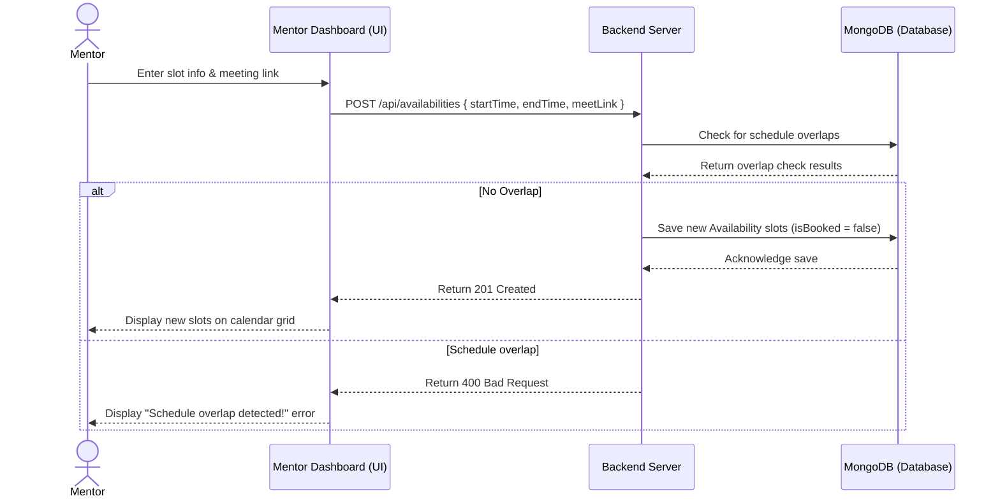

---

### UC-06: Approve Mentor Profile

* **Use Case Segment Diagram:**
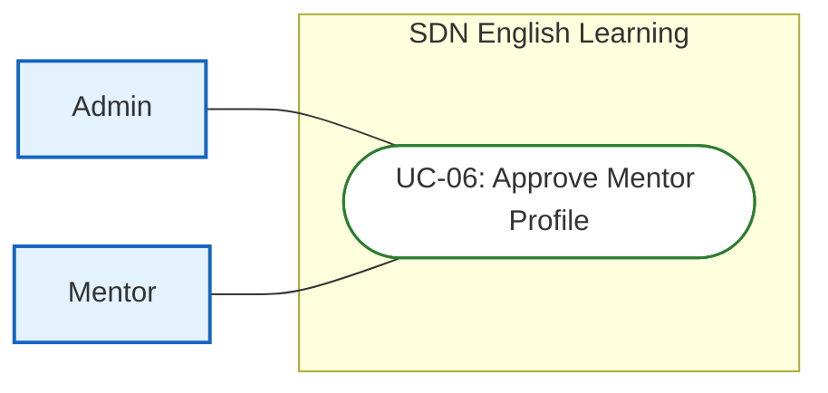

* **Functional Description Template:**
<table style="width: 100%; border-collapse: collapse; margin-bottom: 24px; border: 2px solid #0f172a; font-family: sans-serif; font-size: 14px;">
  <tr>
    <td style="width: 20%; font-weight: bold; background-color: #f1f5f9; padding: 10px; border: 1px solid #cbd5e1;">UC ID and Name:</td>
    <td colspan="3" style="padding: 10px; border: 1px solid #cbd5e1; font-weight: bold; color: #005c42;">UC-06: Approve Mentor Profile</td>
  </tr>
  <tr>
    <td style="font-weight: bold; background-color: #f1f5f9; padding: 10px; border: 1px solid #cbd5e1;">Created By:</td>
    <td style="width: 30%; padding: 10px; border: 1px solid #cbd5e1;">SDN Dev Team</td>
    <td style="width: 20%; font-weight: bold; background-color: #f1f5f9; padding: 10px; border: 1px solid #cbd5e1;">Date Created:</td>
    <td style="width: 30%; padding: 10px; border: 1px solid #cbd5e1;">2026-06-16</td>
  </tr>
  <tr>
    <td style="font-weight: bold; background-color: #f1f5f9; padding: 10px; border: 1px solid #cbd5e1;">Primary Actor:</td>
    <td style="padding: 10px; border: 1px solid #cbd5e1;">Admin</td>
    <td style="font-weight: bold; background-color: #f1f5f9; padding: 10px; border: 1px solid #cbd5e1;">Secondary Actors:</td>
    <td style="padding: 10px; border: 1px solid #cbd5e1;">Mentor</td>
  </tr>
  <tr>
    <td style="font-weight: bold; background-color: #f1f5f9; padding: 10px; border: 1px solid #cbd5e1;">Trigger:</td>
    <td colspan="3" style="padding: 10px; border: 1px solid #cbd5e1;">Admin views pending Mentor applications on user manager dashboard.</td>
  </tr>
  <tr>
    <td style="font-weight: bold; background-color: #f1f5f9; padding: 10px; border: 1px solid #cbd5e1;">Description:</td>
    <td colspan="3" style="padding: 10px; border: 1px solid #cbd5e1;">Admin reviews credentials of new mentors, then approves and activates their account.</td>
  </tr>
  <tr>
    <td style="font-weight: bold; background-color: #f1f5f9; padding: 10px; border: 1px solid #cbd5e1;">Preconditions:</td>
    <td colspan="3" style="padding: 10px; border: 1px solid #cbd5e1; line-height: 1.5;">
      PRE-1: Admin is logged in. 
      PRE-2: Target Mentor registration status is pending in DB.
    </td>
  </tr>
  <tr>
    <td style="font-weight: bold; background-color: #f1f5f9; padding: 10px; border: 1px solid #cbd5e1;">Postconditions:</td>
    <td colspan="3" style="padding: 10px; border: 1px solid #cbd5e1; line-height: 1.5;">
      POST-1: Mentor account status transitions to active (verify = true, status = active) in DB. 
      POST-2: Welcome onboarding email is sent to Mentor.
    </td>
  </tr>
  <tr>
    <td style="font-weight: bold; background-color: #f1f5f9; padding: 10px; border: 1px solid #cbd5e1;">Normal Flow:</td>
    <td colspan="3" style="padding: 10px; border: 1px solid #cbd5e1; line-height: 1.5;">
      <strong>6.0: Onboarding Review Flow</strong> 
      6.0.1. Admin (Actor): Navigates to User tab, filtering by MENTOR and status PENDING. 
      6.0.2. System (System): Displays list of pending applications, showing attachments. 
      6.0.3. Admin (Actor): Reviews attachments, qualifications, and clicks Approve. 
      6.0.4. System (System): Updates mentor status to active (verify = true, status = active) and sends welcome notification. 
      6.0.5. System (System): Hides the approved mentor from pending applications dashboard list.
    </td>
  </tr>
  <tr>
    <td style="font-weight: bold; background-color: #f1f5f9; padding: 10px; border: 1px solid #cbd5e1;">Alternative Flows:</td>
    <td colspan="3" style="padding: 10px; border: 1px solid #cbd5e1; line-height: 1.5;">
      <strong>6.1: Reject Profile</strong> 
      - Branches off from step 6.0.3. Admin clicks Reject, entering rejection comment. 
      - System updates mentor status to inactive, verify = false, sends rejection email notice (rejoining flow at 6.0.5).
    </td>
  </tr>
  <tr>
    <td style="font-weight: bold; background-color: #f1f5f9; padding: 10px; border: 1px solid #cbd5e1;">Exceptions:</td>
    <td colspan="3" style="padding: 10px; border: 1px solid #cbd5e1; line-height: 1.5;">
      <strong>6.0.E1: Document Loading failure</strong> (occurs at 6.0.2; system fails to pull files from Cloudinary storage; admin is prompted to retry; DB state remains pending).
    </td>
  </tr>
  <tr>
    <td style="font-weight: bold; background-color: #f1f5f9; padding: 10px; border: 1px solid #cbd5e1;">Priority:</td>
    <td colspan="3" style="padding: 10px; border: 1px solid #cbd5e1;">Medium (Should Have)</td>
  </tr>
  <tr>
    <td style="font-weight: bold; background-color: #f1f5f9; padding: 10px; border: 1px solid #cbd5e1;">Frequency of Use:</td>
    <td colspan="3" style="padding: 10px; border: 1px solid #cbd5e1;">Low (Triggered only on new registration applications)</td>
  </tr>
  <tr>
    <td style="font-weight: bold; background-color: #f1f5f9; padding: 10px; border: 1px solid #cbd5e1;">Business Rules:</td>
    <td colspan="3" style="padding: 10px; border: 1px solid #cbd5e1;">BR-01, BR-05</td>
  </tr>
  <tr>
    <td style="font-weight: bold; background-color: #f1f5f9; padding: 10px; border: 1px solid #cbd5e1;">Other Information:</td>
    <td colspan="3" style="padding: 10px; border: 1px solid #cbd5e1;">Only approved mentors appear in student searches. Profile documents are stored securely on Cloudinary.</td>
  </tr>
  <tr>
    <td style="font-weight: bold; background-color: #f1f5f9; padding: 10px; border: 1px solid #cbd5e1;">Assumptions:</td>
    <td colspan="3" style="padding: 10px; border: 1px solid #cbd5e1;">Admin has verified accuracy of mentor identity card numbers.</td>
  </tr>
</table>

#### Sequence Diagram
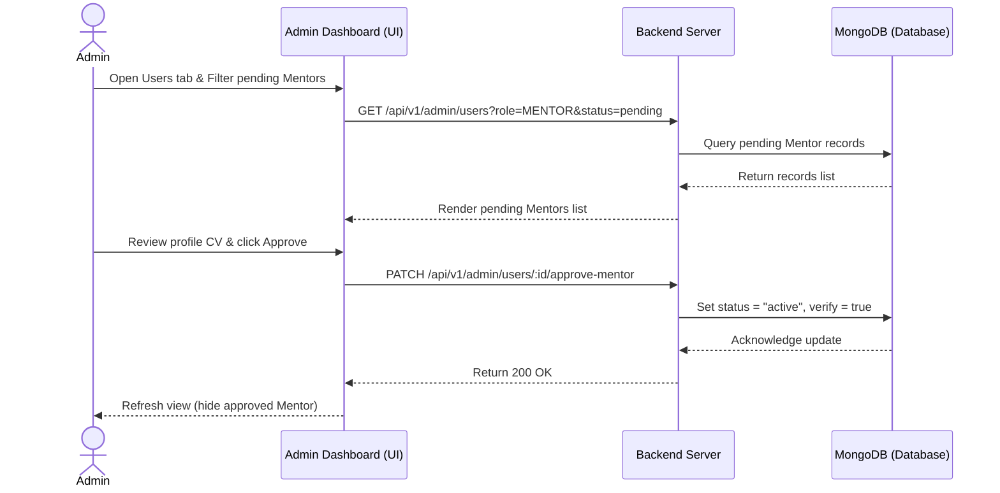

---

### UC-07: Manage Exams (CRUD)

* **Use Case Segment Diagram:**
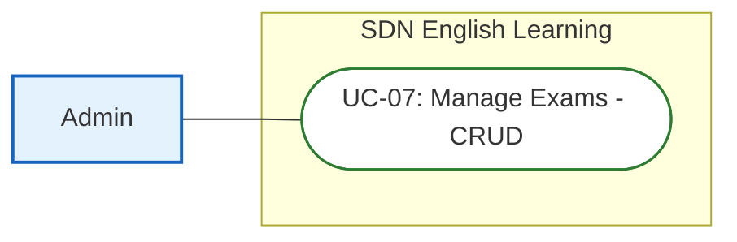

* **Functional Description Template:**
<table style="width: 100%; border-collapse: collapse; margin-bottom: 24px; border: 2px solid #0f172a; font-family: sans-serif; font-size: 14px;">
  <tr>
    <td style="width: 20%; font-weight: bold; background-color: #f1f5f9; padding: 10px; border: 1px solid #cbd5e1;">UC ID and Name:</td>
    <td colspan="3" style="padding: 10px; border: 1px solid #cbd5e1; font-weight: bold; color: #005c42;">UC-07: Manage Exams (CRUD)</td>
  </tr>
  <tr>
    <td style="font-weight: bold; background-color: #f1f5f9; padding: 10px; border: 1px solid #cbd5e1;">Created By:</td>
    <td style="width: 30%; padding: 10px; border: 1px solid #cbd5e1;">SDN Dev Team</td>
    <td style="width: 20%; font-weight: bold; background-color: #f1f5f9; padding: 10px; border: 1px solid #cbd5e1;">Date Created:</td>
    <td style="width: 30%; padding: 10px; border: 1px solid #cbd5e1;">2026-06-16</td>
  </tr>
  <tr>
    <td style="font-weight: bold; background-color: #f1f5f9; padding: 10px; border: 1px solid #cbd5e1;">Primary Actor:</td>
    <td style="padding: 10px; border: 1px solid #cbd5e1;">Admin</td>
    <td style="font-weight: bold; background-color: #f1f5f9; padding: 10px; border: 1px solid #cbd5e1;">Secondary Actors:</td>
    <td style="padding: 10px; border: 1px solid #cbd5e1;">None</td>
  </tr>
  <tr>
    <td style="font-weight: bold; background-color: #f1f5f9; padding: 10px; border: 1px solid #cbd5e1;">Trigger:</td>
    <td colspan="3" style="padding: 10px; border: 1px solid #cbd5e1;">Admin wants to import a new practice exam or update existing test sheets.</td>
  </tr>
  <tr>
    <td style="font-weight: bold; background-color: #f1f5f9; padding: 10px; border: 1px solid #cbd5e1;">Description:</td>
    <td colspan="3" style="padding: 10px; border: 1px solid #cbd5e1;">Admin manages IELTS practice tests (Reading/Listening) including passages, audios, questions, answer keys, and explanations.</td>
  </tr>
  <tr>
    <td style="font-weight: bold; background-color: #f1f5f9; padding: 10px; border: 1px solid #cbd5e1;">Preconditions:</td>
    <td colspan="3" style="padding: 10px; border: 1px solid #cbd5e1; line-height: 1.5;">
      PRE-1: Admin is logged in. 
      PRE-2: Admin has access authorization rights.
    </td>
  </tr>
  <tr>
    <td style="font-weight: bold; background-color: #f1f5f9; padding: 10px; border: 1px solid #cbd5e1;">Postconditions:</td>
    <td colspan="3" style="padding: 10px; border: 1px solid #cbd5e1; line-height: 1.5;">
      POST-1: Exam database structures are updated. 
      POST-2: Newly registered/edited exam is published and visible on Student dashboard.
    </td>
  </tr>
  <tr>
    <td style="font-weight: bold; background-color: #f1f5f9; padding: 10px; border: 1px solid #cbd5e1;">Normal Flow:</td>
    <td colspan="3" style="padding: 10px; border: 1px solid #cbd5e1; line-height: 1.5;">
      <strong>7.0: Exam Management CRUD Flow</strong> 
      7.0.1. Admin (Actor): Navigates to Exams management page and clicks Add Exam. 
      7.0.2. System (System): Displays empty exam template forms. 
      7.0.3. Admin (Actor): Fills metadata details, uploads asset files, enters question sheets mapping, and clicks Save. 
      7.0.4. System (System): Validates the data schema, saves new Exam records to DB, and releases lock. 
      7.0.5. System (System): Returns created success message, displaying update listing.
    </td>
  </tr>
  <tr>
    <td style="font-weight: bold; background-color: #f1f5f9; padding: 10px; border: 1px solid #cbd5e1;">Alternative Flows:</td>
    <td colspan="3" style="padding: 10px; border: 1px solid #cbd5e1; line-height: 1.5;">
      <strong>7.1: JSON batch import</strong> 
      - Branches off from step 7.0.2. Admin clicks upload, choosing a JSON template. 
      - System parses structure, validates schema inputs, and saves entries (rejoining flow at 7.0.5).
    </td>
  </tr>
  <tr>
    <td style="font-weight: bold; background-color: #f1f5f9; padding: 10px; border: 1px solid #cbd5e1;">Exceptions:</td>
    <td colspan="3" style="padding: 10px; border: 1px solid #cbd5e1; line-height: 1.5;">
      <strong>7.0.E1: Validation Schema Mismatch</strong> (occurs at 7.0.4; System displays red validation highlights and blocks saving; database state remains unchanged). 
      <strong>7.0.E2: JSON Format Corruption</strong> (occurs at 7.1; system rejects import, logs the line numbers of format errors; database state remains unchanged).
    </td>
  </tr>
  <tr>
    <td style="font-weight: bold; background-color: #f1f5f9; padding: 10px; border: 1px solid #cbd5e1;">Priority:</td>
    <td colspan="3" style="padding: 10px; border: 1px solid #cbd5e1;">Low (On content creation demands)</td>
  </tr>
  <tr>
    <td style="font-weight: bold; background-color: #f1f5f9; padding: 10px; border: 1px solid #cbd5e1;">Frequency of Use:</td>
    <td colspan="3" style="padding: 10px; border: 1px solid #cbd5e1;">Regular (Admin exam additions)</td>
  </tr>
  <tr>
    <td style="font-weight: bold; background-color: #f1f5f9; padding: 10px; border: 1px solid #cbd5e1;">Business Rules:</td>
    <td colspan="3" style="padding: 10px; border: 1px solid #cbd5e1;">BR-02</td>
  </tr>
  <tr>
    <td style="font-weight: bold; background-color: #f1f5f9; padding: 10px; border: 1px solid #cbd5e1;">Other Information:</td>
    <td colspan="3" style="padding: 10px; border: 1px solid #cbd5e1;">Audio file formats are validated. Unfinished changes are discarded and not saved.</td>
  </tr>
  <tr>
    <td style="font-weight: bold; background-color: #f1f5f9; padding: 10px; border: 1px solid #cbd5e1;">Assumptions:</td>
    <td colspan="3" style="padding: 10px; border: 1px solid #cbd5e1;">Uploaded questions comply with official IELTS guidelines.</td>
  </tr>
</table>

#### Sequence Diagram
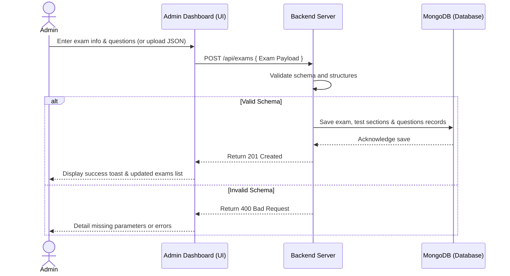

---

### UC-08: User Management

* **Use Case Segment Diagram:**
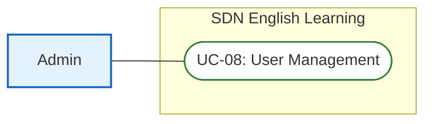

* **Functional Description Template:**
<table style="width: 100%; border-collapse: collapse; margin-bottom: 24px; border: 2px solid #0f172a; font-family: sans-serif; font-size: 14px;">
  <tr>
    <td style="width: 20%; font-weight: bold; background-color: #f1f5f9; padding: 10px; border: 1px solid #cbd5e1;">UC ID and Name:</td>
    <td colspan="3" style="padding: 10px; border: 1px solid #cbd5e1; font-weight: bold; color: #005c42;">UC-08: User Management</td>
  </tr>
  <tr>
    <td style="font-weight: bold; background-color: #f1f5f9; padding: 10px; border: 1px solid #cbd5e1;">Created By:</td>
    <td style="width: 30%; padding: 10px; border: 1px solid #cbd5e1;">SDN Dev Team</td>
    <td style="width: 20%; font-weight: bold; background-color: #f1f5f9; padding: 10px; border: 1px solid #cbd5e1;">Date Created:</td>
    <td style="width: 30%; padding: 10px; border: 1px solid #cbd5e1;">2026-06-16</td>
  </tr>
  <tr>
    <td style="font-weight: bold; background-color: #f1f5f9; padding: 10px; border: 1px solid #cbd5e1;">Primary Actor:</td>
    <td style="padding: 10px; border: 1px solid #cbd5e1;">Admin</td>
    <td style="font-weight: bold; background-color: #f1f5f9; padding: 10px; border: 1px solid #cbd5e1;">Secondary Actors:</td>
    <td style="padding: 10px; border: 1px solid #cbd5e1;">None</td>
  </tr>
  <tr>
    <td style="font-weight: bold; background-color: #f1f5f9; padding: 10px; border: 1px solid #cbd5e1;">Trigger:</td>
    <td colspan="3" style="padding: 10px; border: 1px solid #cbd5e1;">Admin wishes to search users, edit details, or suspend/unsuspend accounts.</td>
  </tr>
  <tr>
    <td style="font-weight: bold; background-color: #f1f5f9; padding: 10px; border: 1px solid #cbd5e1;">Description:</td>
    <td colspan="3" style="padding: 10px; border: 1px solid #cbd5e1;">Admin searches users, filters by role (Student/Mentor) or status, and performs modifications or toggle locks.</td>
  </tr>
  <tr>
    <td style="font-weight: bold; background-color: #f1f5f9; padding: 10px; border: 1px solid #cbd5e1;">Preconditions:</td>
    <td colspan="3" style="padding: 10px; border: 1px solid #cbd5e1; line-height: 1.5;">
      PRE-1: Admin is logged in. 
      PRE-2: Admin holds User Admin role configuration parameters.
    </td>
  </tr>
  <tr>
    <td style="font-weight: bold; background-color: #f1f5f9; padding: 10px; border: 1px solid #cbd5e1;">Postconditions:</td>
    <td colspan="3" style="padding: 10px; border: 1px solid #cbd5e1; line-height: 1.5;">
      POST-1: Target user status (active/inactive) is updated in DB. 
      POST-2: Banned user sessions are invalidated immediately.
    </td>
  </tr>
  <tr>
    <td style="font-weight: bold; background-color: #f1f5f9; padding: 10px; border: 1px solid #cbd5e1;">Normal Flow:</td>
    <td colspan="3" style="padding: 10px; border: 1px solid #cbd5e1; line-height: 1.5;">
      <strong>8.0: User Admin Management Flow</strong> 
      8.0.1. Admin (Actor): Accesses the User List section on dashboard. 
      8.0.2. System (System): Displays paginated active users table with search bar. 
      8.0.3. Admin (Actor): Searches username, finds target, and clicks Toggle Block Status. 
      8.0.4. System (System): Disables user status in DB, revokes existing JSON token cookies, and records lock activity logs. 
      8.0.5. System (System): Updates page status labels instantly.
    </td>
  </tr>
  <tr>
    <td style="font-weight: bold; background-color: #f1f5f9; padding: 10px; border: 1px solid #cbd5e1;">Alternative Flows:</td>
    <td colspan="3" style="padding: 10px; border: 1px solid #cbd5e1;">None</td>
  </tr>
  <tr>
    <td style="font-weight: bold; background-color: #f1f5f9; padding: 10px; border: 1px solid #cbd5e1;">Exceptions:</td>
    <td colspan="3" style="padding: 10px; border: 1px solid #cbd5e1; line-height: 1.5;">
      <strong>8.0.E1: Self-Suspension or Admin-Ban Attempt</strong> (occurs at 8.0.4; Admin tries to toggle block on their own account or another Administrator; backend returns 400 Bad Request and blocks execution; database remains unchanged).
    </td>
  </tr>
  <tr>
    <td style="font-weight: bold; background-color: #f1f5f9; padding: 10px; border: 1px solid #cbd5e1;">Priority:</td>
    <td colspan="3" style="padding: 10px; border: 1px solid #cbd5e1;">Medium (Should Have)</td>
  </tr>
  <tr>
    <td style="font-weight: bold; background-color: #f1f5f9; padding: 10px; border: 1px solid #cbd5e1;">Frequency of Use:</td>
    <td colspan="3" style="padding: 10px; border: 1px solid #cbd5e1;">Regular (Daily admin surveillance checks)</td>
  </tr>
  <tr>
    <td style="font-weight: bold; background-color: #f1f5f9; padding: 10px; border: 1px solid #cbd5e1;">Business Rules:</td>
    <td colspan="3" style="padding: 10px; border: 1px solid #cbd5e1;">BR-05</td>
  </tr>
  <tr>
    <td style="font-weight: bold; background-color: #f1f5f9; padding: 10px; border: 1px solid #cbd5e1;">Other Information:</td>
    <td colspan="3" style="padding: 10px; border: 1px solid #cbd5e1;">Banned accounts cannot register new credentials with the same email or phone details.</td>
  </tr>
  <tr>
    <td style="font-weight: bold; background-color: #f1f5f9; padding: 10px; border: 1px solid #cbd5e1;">Assumptions:</td>
    <td colspan="3" style="padding: 10px; border: 1px solid #cbd5e1;">Admin has proper authority levels before issuing lock actions.</td>
  </tr>
</table>

#### Sequence Diagram
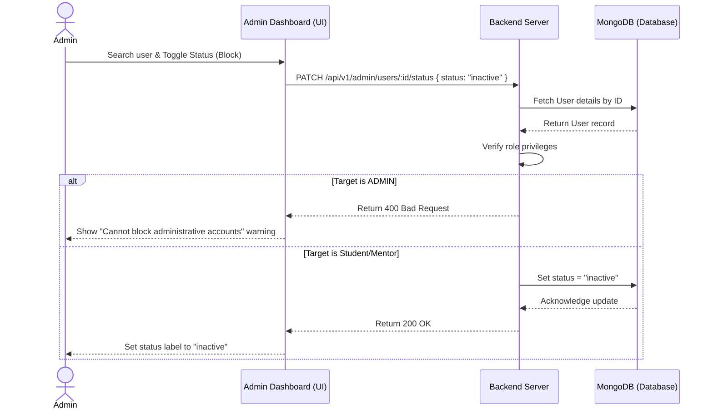

---

### UC-09: View Results & Feedback

* **Use Case Segment Diagram:**
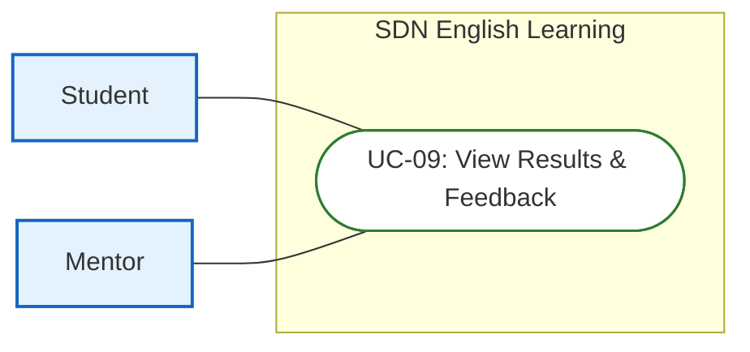

* **Functional Description Template:**
<table style="width: 100%; border-collapse: collapse; margin-bottom: 24px; border: 2px solid #0f172a; font-family: sans-serif; font-size: 14px;">
  <tr>
    <td style="width: 20%; font-weight: bold; background-color: #f1f5f9; padding: 10px; border: 1px solid #cbd5e1;">UC ID and Name:</td>
    <td colspan="3" style="padding: 10px; border: 1px solid #cbd5e1; font-weight: bold; color: #005c42;">UC-09: View Results & Feedback</td>
  </tr>
  <tr>
    <td style="font-weight: bold; background-color: #f1f5f9; padding: 10px; border: 1px solid #cbd5e1;">Created By:</td>
    <td style="width: 30%; padding: 10px; border: 1px solid #cbd5e1;">SDN Dev Team</td>
    <td style="width: 20%; font-weight: bold; background-color: #f1f5f9; padding: 10px; border: 1px solid #cbd5e1;">Date Created:</td>
    <td style="width: 30%; padding: 10px; border: 1px solid #cbd5e1;">2026-06-16</td>
  </tr>
  <tr>
    <td style="font-weight: bold; background-color: #f1f5f9; padding: 10px; border: 1px solid #cbd5e1;">Primary Actor:</td>
    <td style="padding: 10px; border: 1px solid #cbd5e1;">Student, Mentor</td>
    <td style="font-weight: bold; background-color: #f1f5f9; padding: 10px; border: 1px solid #cbd5e1;">Secondary Actors:</td>
    <td style="padding: 10px; border: 1px solid #cbd5e1;">None</td>
  </tr>
  <tr>
    <td style="font-weight: bold; background-color: #f1f5f9; padding: 10px; border: 1px solid #cbd5e1;">Trigger:</td>
    <td colspan="3" style="padding: 10px; border: 1px solid #cbd5e1;">Student reviews past tests or mentor reviews; Mentor opens history to input session notes.</td>
  </tr>
  <tr>
    <td style="font-weight: bold; background-color: #f1f5f9; padding: 10px; border: 1px solid #cbd5e1;">Description:</td>
    <td colspan="3" style="padding: 10px; border: 1px solid #cbd5e1;">Student reviews graded tests (correctness maps, explanations, paraphrase tags) or reads mentor notes. Mentor inputs feedback for completed slots.</td>
  </tr>
  <tr>
    <td style="font-weight: bold; background-color: #f1f5f9; padding: 10px; border: 1px solid #cbd5e1;">Preconditions:</td>
    <td colspan="3" style="padding: 10px; border: 1px solid #cbd5e1; line-height: 1.5;">
      PRE-1: User is logged in. 
      PRE-2: Target mock test session or booked mentor appointment has concluded.
    </td>
  </tr>
  <tr>
    <td style="font-weight: bold; background-color: #f1f5f9; padding: 10px; border: 1px solid #cbd5e1;">Postconditions:</td>
    <td colspan="3" style="padding: 10px; border: 1px solid #cbd5e1; line-height: 1.5;">
      POST-1: System renders detailed scoreboard, correctness outlines, explanations, and mentor comments. 
      POST-2: Mentor notes are updated in Booking documents.
    </td>
  </tr>
  <tr>
    <td style="font-weight: bold; background-color: #f1f5f9; padding: 10px; border: 1px solid #cbd5e1;">Normal Flow:</td>
    <td colspan="3" style="padding: 10px; border: 1px solid #cbd5e1; line-height: 1.5;">
      <strong>9.0: Results Visualizing Flow</strong> 
      9.0.1. Student (Actor): Clicks Exam History tab on portal page and selects a completed test record. 
      9.0.2. System (System): Fetches test results and question sheets metadata, calculating correct counts. 
      9.0.3. Student (Actor): Highlights a specific answer index to check explanations. 
      9.0.4. System (System): Displays correct explanation text and overlay highlights for paraphrased text.
    </td>
  </tr>
  <tr>
    <td style="font-weight: bold; background-color: #f1f5f9; padding: 10px; border: 1px solid #cbd5e1;">Alternative Flows:</td>
    <td colspan="3" style="padding: 10px; border: 1px solid #cbd5e1; line-height: 1.5;">
      <strong>9.1: Mentor Review Input</strong> 
      - Branches off from step 9.0.1. Mentor opens tutoring session log list, selects a slot, types comments, and clicks Save. 
      - System saves qualitative review in Booking model, making it visible to students (rejoining flow at 9.0.4).
    </td>
  </tr>
  <tr>
    <td style="font-weight: bold; background-color: #f1f5f9; padding: 10px; border: 1px solid #cbd5e1;">Exceptions:</td>
    <td colspan="3" style="padding: 10px; border: 1px solid #cbd5e1; line-height: 1.5;">
      <strong>9.0.E1: Data Corruption on Exam Results</strong> (occurs at 9.0.2; backend fails to fetch exam answers key; system outputs error notification; state remains unchanged).
    </td>
  </tr>
  <tr>
    <td style="font-weight: bold; background-color: #f1f5f9; padding: 10px; border: 1px solid #cbd5e1;">Priority:</td>
    <td colspan="3" style="padding: 10px; border: 1px solid #cbd5e1;">High (Must Have)</td>
  </tr>
  <tr>
    <td style="font-weight: bold; background-color: #f1f5f9; padding: 10px; border: 1px solid #cbd5e1;">Frequency of Use:</td>
    <td colspan="3" style="padding: 10px; border: 1px solid #cbd5e1;">High (Every finished session check)</td>
  </tr>
  <tr>
    <td style="font-weight: bold; background-color: #f1f5f9; padding: 10px; border: 1px solid #cbd5e1;">Business Rules:</td>
    <td colspan="3" style="padding: 10px; border: 1px solid #cbd5e1;">BR-02, BR-05</td>
  </tr>
  <tr>
    <td style="font-weight: bold; background-color: #f1f5f9; padding: 10px; border: 1px solid #cbd5e1;">Other Information:</td>
    <td colspan="3" style="padding: 10px; border: 1px solid #cbd5e1;">Students cannot modify mentor feedback. If network drops during saving, the note is rolled back to previous version.</td>
  </tr>
  <tr>
    <td style="font-weight: bold; background-color: #f1f5f9; padding: 10px; border: 1px solid #cbd5e1;">Assumptions:</td>
    <td colspan="3" style="padding: 10px; border: 1px solid #cbd5e1;">User exam submission logs are correctly persisted and non-null in DB.</td>
  </tr>
</table>

#### Sequence Diagram
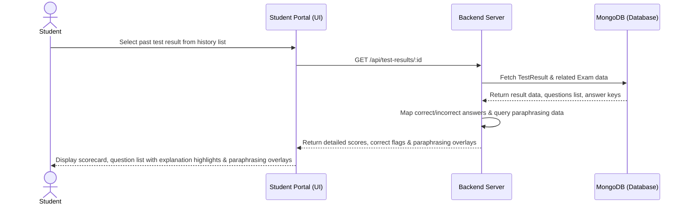

---

## 4. Platform Business Rules

### BR-01: Authentication & Security Rules
* **Password Hashing:** Passwords must be hashed using `bcrypt` with a work factor (salt rounds) of at least 10 before saving to MongoDB.
* **Token Rotation Policy:** Access tokens expire in 15 minutes and are stored in frontend memory (Redux state). Refresh tokens expire in 7 days and must be stored in an `HttpOnly`, `Secure`, and `SameSite=Strict` cookie to prevent XSS/CSRF attacks.
* **Mentor Onboarding Status:** Mentor registrations default to `pending`. Pending mentors are blocked from logging in or listing availabilities until an Administrator reviews their credentials and marks their status as `active`.

### BR-02: IELTS Mock Examination Rules
* **Exam Constraints:** IELTS Reading exams must contain exactly 3 passages and exactly 40 questions (60 minutes duration). IELTS Listening exams must contain 4 sections with 1 audio payload and exactly 40 questions (30 minutes duration).
* **Band Score Conversions:** The database score calculation service converts raw scores (0-40) into IELTS band scores (1.0-9.0) using the standardized IELTS conversion scale:
  * Raw Score 39-40: Band 9.0
  * Raw Score 37-38: Band 8.5
  * Raw Score 35-36: Band 8.0
  * Raw Score 32-34: Band 7.5
  * Raw Score 30-31: Band 7.0
  * Raw Score 27-29: Band 6.5
  * Raw Score 23-26: Band 6.0
  * Raw Score 19-22: Band 5.5
  * Raw Score 15-18: Band 5.0
  * Raw Score 13-14: Band 4.5
  * Raw Score 10-12: Band 4.0
  * Raw Score under 10: Band 3.5 or below

### BR-03: AI Speaking Practice Rules
* **Performance SLA:** The AI Speaking evaluation pipeline (consisting of Speech-to-Text translation and Gemini API analysis) must respond in under 7 seconds from receiving the recording's end marker.
* **Audio Cache TTL:** Temporary audio files uploaded to Cloudinary/local cache must be deleted automatically once grading succeeds or after a maximum of 3 failed retries.
* **Rubric Mappings:** AI output must yield distinct band scores and feedback paragraphs for all four official IELTS Speaking criteria: Fluency & Coherence, Lexical Resource, Grammatical Range & Accuracy, and Pronunciation.

### BR-04: Mentor Booking & Scheduling Rules
* **Concurrency Locking (Race Conditions):** Double booking of a mentor slot is prevented by obtaining a distributed lock on Redis (`SETNX` key: `availabilityId_lock`) with a 10-second TTL during database booking transactions.
* **Lead Time Rules:** Mentors can only create availability slots starting at least 1 hour in the future.
* **Schedule Modifications:** A Mentor can edit or delete an availability slot only if it has not been booked by a student (`isBooked == false`).
* **Session Validation:** Google Meet or Zoom room URLs must pass system schema validations during availability updates.

### BR-05: User & Platform Governance Rules
* **Visibility Filter:** Only active, approved mentors with `verify = true` and `status = "active"` appear in student searches.
* **Admin Hierarchy Limits:** Admin accounts are restricted from changing their own roles, blocking themselves, or suspending other Administrator accounts.
* **Access Control Controls:** Students are authorized to read only their own history logs and submissions. Mentors are allowed to add qualitative feedback notes only for sessions that they hosted and which have concluded.
